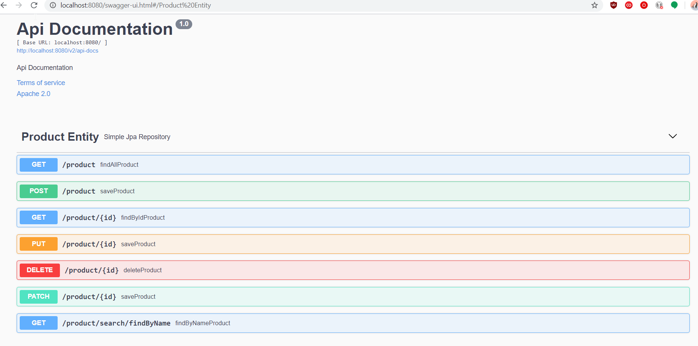

# example-springboot-rest-k8s

Example application for spring boot ready to be deployed on k8s and OpenShift using Helm.


## Aplication specification

It is RESTful application with Java implemented with Spring Boot.

Api support:

● Create a new product
● Retrieve a list of all products
● Update a product (Optional)
● Delete a product (soft deletion) (Optional)

## Application build

### Build with maven

With mvn will get an all in one java-jar

```
mvn install
```

### Build with Docker

Docker build contains all for building the jar and store it in a Docker image

```
docker build . -t products-example
```

## Application execution

Local Maven run:

```
mvn spring-boot:run
```

### Application api

Application api can be found with swagger in the url:


http://localhost:8080/swagger-ui.html



#### Get list of products
http://localhost:8080/product

## Application Description

### Database creation

The database creation and upgrades is done using liquibase, every update will contain the scripts for database update.

The database creation is handled by the yaml and sql files in the src/main/resources/db folder